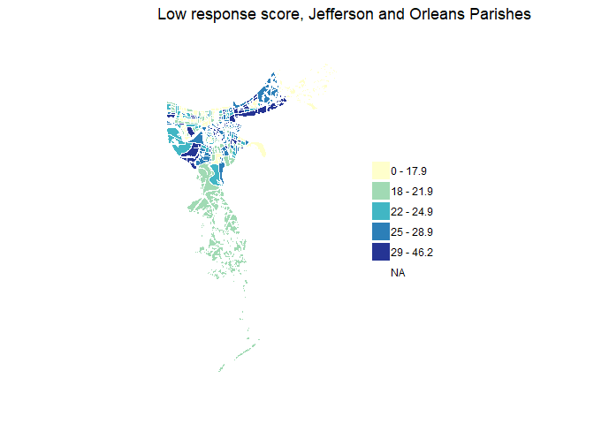
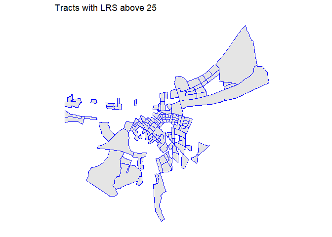
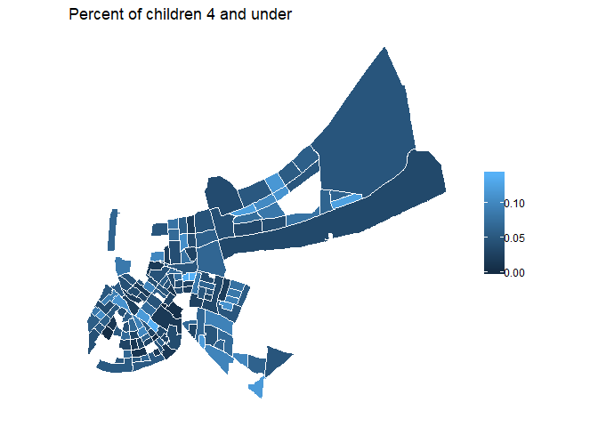

Data user guide
================
Jenna
December 16, 2019

### Objective: Describe the data required for the Census 2020 planning maps in order to facilitate decisionmaking around presentation of the data.

#### Low Response Score

The Low Response Score (LRS) is an ordinarly least-squares regression
model fitted on 25 variables that: 1. best predicted 2010 mail
no-response rate, and  
2\. have practical interpretation for outreach (e.g., include population
of single mothers, exclude MOEs).

Point (1) is especially important, as it means the LRS does not account
for internet response. One potential risk in using this data for the use
case of outreach is misappropriating resources to neighborhoods of
highly internet-literate residents like young, mobile renters, who would
be considered HTC according to mail return rate, but may not in fact be
HTC with the advent of the internet census.

The LRS is a predicted mail non-response rate, so “an LRS value of 17.7
should be interpreted as 17.7% of households in that census tract are
predicted to NOT self-respond to the decennial census.” Percentage of
renters, percentage of people aged 18-24, and percentage of households
headed by unmarried females are the strongest predictors.

I have not been able to find a recommended threshold for what LRS is
most important in the research paper, FAQ, ROAM user guide, or NNIP
partners’ publications. A map in an article titles “Identifying
Hard-to-Survey Populations Using Low Response Scores by Census Tract” on
the Census website uses the breakdown of LRS 0 - 17.9, 18 - 21.9, 22 -
24.9, 25 - 28.9, 29 - 46.2.

The national non-response rate in 2010 was 20.7 percent, of course with
large geographic variation. Even so, that number could serve as a good
cutoff for determining HTC.

Below is a map of New Orleans tract-level LRS broken into the same
groups the CB shows.

<!-- -->

The map below shows that a large majority of tracts in New Orleans are
predicted to have a lower response rate in 2020 than the national
response rate in 2010.

<!-- -->

#### Young children

Below is a map of the same tracts mapped above (i.e. those predicted to
have a lower response rate in 2020 than the national response rate in
2010), colored according to the number of children 4 and younger living
there as of ACS 2013-2017.

<!-- -->

Below is a map of the same tracts mapped above, colored according to the
percent of children 4 and younger living there as of ACS 2013-2017.

<!-- -->

#### English as a barrier

The most straighforward measure of English ability is the English
ability question from the ACS.

A paper published at the Census Bureau reports “that the English-ability
question, despite being a self-assessment, does a good job of measuring
English ability.”

In Neighborhood Profiles, we group categories of English ability
according to the following logic: “We’ve combined the categories of
people who speak only English at home with those who speak another
language at home but report that they speak English ‘well.’ This way we
can focus on data about those individuals for whom speaking English is a
barrier.”

<!-- -->

<!-- -->
